# SSAFY생들 간의 코딩장비 공유 서비스 - COALA
> 자신에게 맞는 코딩장비를 찾아보고, P2P 대여 및 거래를 진행하는 중개 사이트

<br>

### 프로젝트 기간 🗓️
- 2023.07.04 ~ 2023.08.18

<br>

### 개발환경 🛠️
>
> Java 17.
> >
> Spring Boot 3.1.2.
> > 
> Node.js 18.
> >
> Next 13.2.4.
> >
> React 18.2.0.

<br>

## 0. 팀원 🧑‍🤝‍🧑

| 팀원| 역할 | 담당 | 파트 |
|:---|:---|:---|:---|
|정선재|팀장| Front End | 홈 화면, 기술 게시판, 자유 게시판 |
|심은진|팀원| Front End | 채팅, 거래 및 계약서, 마이페이지, 카카오페이 결제 |
|서지호|팀원| Front End | 제공자 게시판, 이용자 게시판 |
|강승현|팀원| Back End | 인프라 구축, 멤버 관리, 거래 게시판 | 
|권민우|팀원| Back End | 커뮤니티 게시판, 디버깅, 코드 테스트 |
|김수찬|팀원| Back End | 인프라 구축, 채팅I/O, 거래 및 계약 |

### 0.1 상세 업무 분담 내역
---
<br>

**공통**: 
- 데이터베이스 모델링 
- 컴포넌트 구조 분석
- 시스템 목업

**정선재**: 
| 개발 분야| 역할 |
|:---:|:---|
|인프라 구축| - 적어주세요<br> - 적어주세요<br> - 적어주세요 <br> - 적어주세요|
|멤버 관리| - 적어주세요<br> - 적어주세요|

**심은진**:
| 개발 분야| 역할 |
|:---:|:---|
|인프라 구축| - 적어주세요<br> - 적어주세요<br> - 적어주세요 <br> - 적어주세요|
|멤버 관리| - 적어주세요<br> - 적어주세요|

**서지호**: 
| 개발 분야| 역할 |
|:---:|:---|
|인프라 구축| - 적어주세요<br> - 적어주세요<br> - 적어주세요 <br> - 적어주세요|
|멤버 관리| - 적어주세요<br> - 적어주세요|

**강승현**:
| 개발 분야| 역할 |
|:---:|:---|
|인프라 구축| Docker, Jenkins 구성으로 자동 배포 시스템 구축, GitLab을 이용한 버전 관리 |
|멤버 관리| JWT 토큰을 통한 User 관리 및 보안 체계 구축 |
|개 발 | SpringBoot를 이용한 기능 개발 |
|DB 관리| MySQL을 활용한 데이터베이스 관리|

**권민우**: 
| 개발 분야| 역할 |
|:---:|:---|
|인프라 구축| - 적어주세요<br> - 적어주세요<br> - 적어주세요 <br> - 적어주세요|
|멤버 관리| - 적어주세요<br> - 적어주세요|

**김수찬**:
| 개발 분야| 역할 |
|:---:|:---|
| 인프라 구축 | - Jenkins을 활용하여 Docker Hub에 Image 관리 <br> - Docker Hub를 통한 버전 관리 <br> - Service를 분할하여 서버의 가용성을 높임 <br> - S3를 활용한 이미지 저장 |
| 채팅 I/O | - Next.js 를 활용하여 채팅 중계 서버 생성 <br> - Node.js의 특징인 이벤트 드리븐 모델을 활용 효율성을 높임 <br> - 프론트와 동일한 언어 사용으로 개발 및 유지보수성을 높임 |
| 거래 및 계약 | - 계약서 정보를 받아와 png 형태로 계약서를 저장 <br> - 저장된 계약서는 S3 에서 수정 불가능 하게 관리 |

<br>

## 1. 구조도

### 1.1. 아키텍쳐 구조 🔗
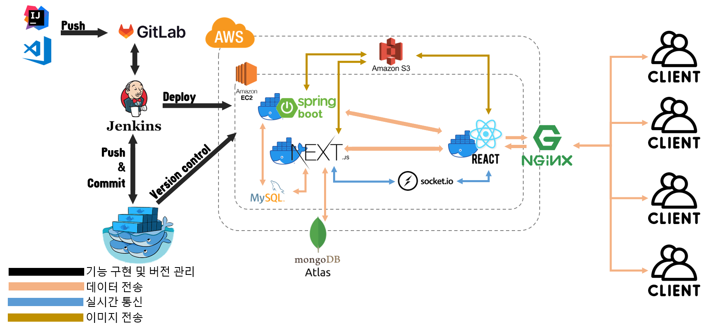

---
### 1.2. ERD 구조 🎛
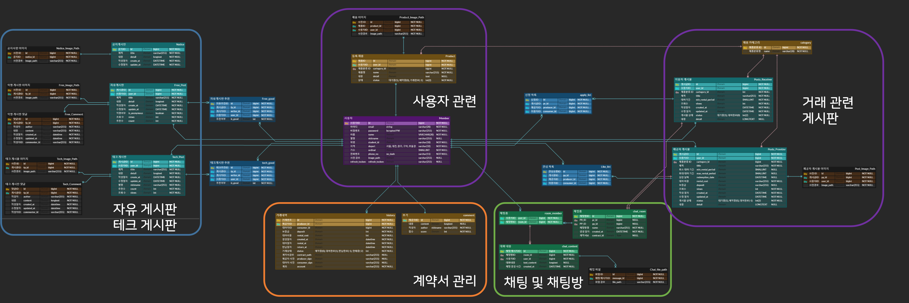

---
### 1.3. 컴포넌트 구조 🎞
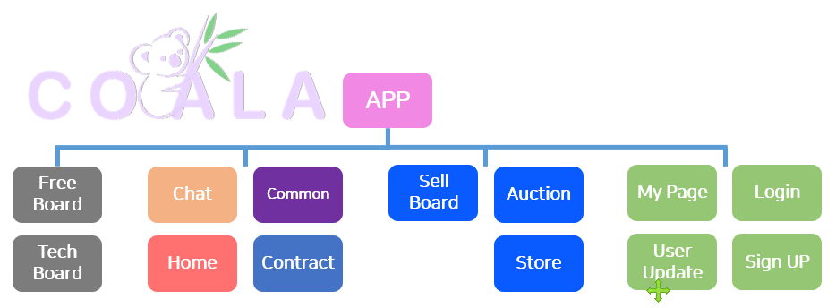


<br>

### 1.4. 폴더 구조
---
#### 폴더 양이 많기에 따로 위치시켰습니다.
[파일 구조도 위치](./docs/File_Content/README.md)


<br>

## 2. 개요 📑

### 2.1 목표 서비스
```
    1. 자신에게 맞는 장비를 미리 사용하고 판단하므로 불필요한 소비를 줄일 수 있는 서비스
    2. 사용하지 않는 장비를 렌탈 해주며, 용돈을 마련할 수 있는 서비스
    3. 기수간의 대화가 부족한 SSAFY생들에게 대화의 장을 마련하는 서비스
```
### 2.2 상세 네용
> 0. 시작페이지
```
1. 서비스에 대한 전체적인 설명
```

> 1. 메인페이지
```
1. 목표 서비스 작성
2. 목표 서비스 작성
3. 목표 서비스 작성
4. 목표 서비스 작성
5. 목표 서비스 작성
```

> 2. 마이 페이지
```
1. 자신이 쓴 글 표시
2. 거래 내역 표시
3. 관심 표시한 글 표시
4. 로그아웃
```

> 3. 자유게시판 및 테크게시판
```
1. 글 작성과 좋아요 기능
2. 댓글 작성과 익명 댓글
3. 이미지 첨부
4. 최신 테크 이슈 공유와 자유로운 소통의 장
```

> 4. 제공자 게시판
```
1. 대여 조건글 작성과 좋아요 기능
2. 다수의 이미지 첨부와 확인
3. 무한스크롤로 게시글 카드형 표시
4. 카드에 게시글 사진, 좋아요, 판매정보 요약
5. 필터로 원하는 대여 게시글 탐색
6. 목표 서비스 작성
7. 거래 요청시 채팅으로 연결
```

> 5. 이용자 게시판
```
1. 원하는 제품 조건 작성
2. 필터로 원하는 조건 글 탐색
3. 타인의 글에 폼으로 제안서 보내기
4. 폼에 다수의 이미지 첨부와 확인
5. 자신의 글에 제안온 폼 목록 확인
6. 거래 의사 보유시 채팅으로 연결
```


> 6. 채팅
```
1. 특정 게시글에 대한 채팅방
2. 제안서 작성 
3. 계약서 & 거래로 이동
```


> 7. 계약서 작성
```
1. 상호 사인 기능
```

> 8. 결제
```
1. 목표 서비스 작성
```

<br>

## 3. 웹 사이트 예시 📺

### **메인 페이지**
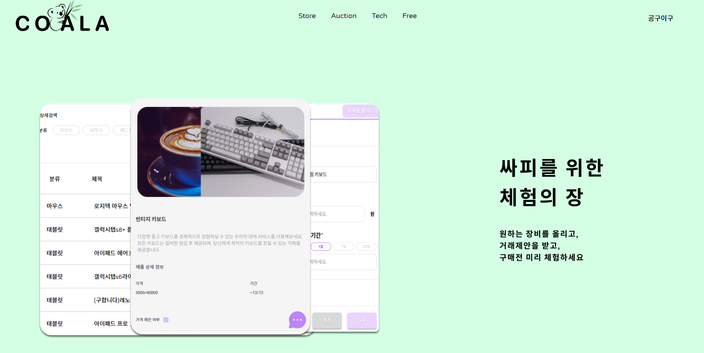
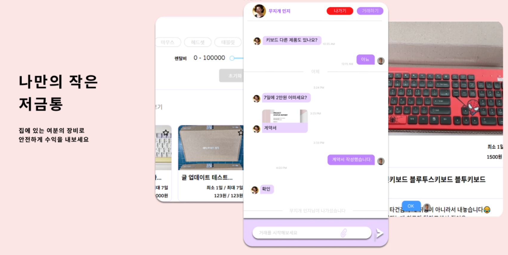

<br>

### **마이 페이지**
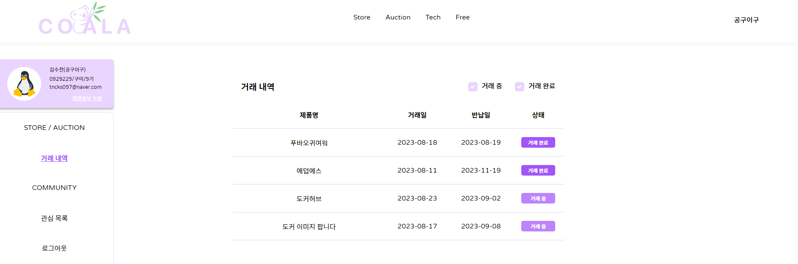

<br>


### **자유게시판 **
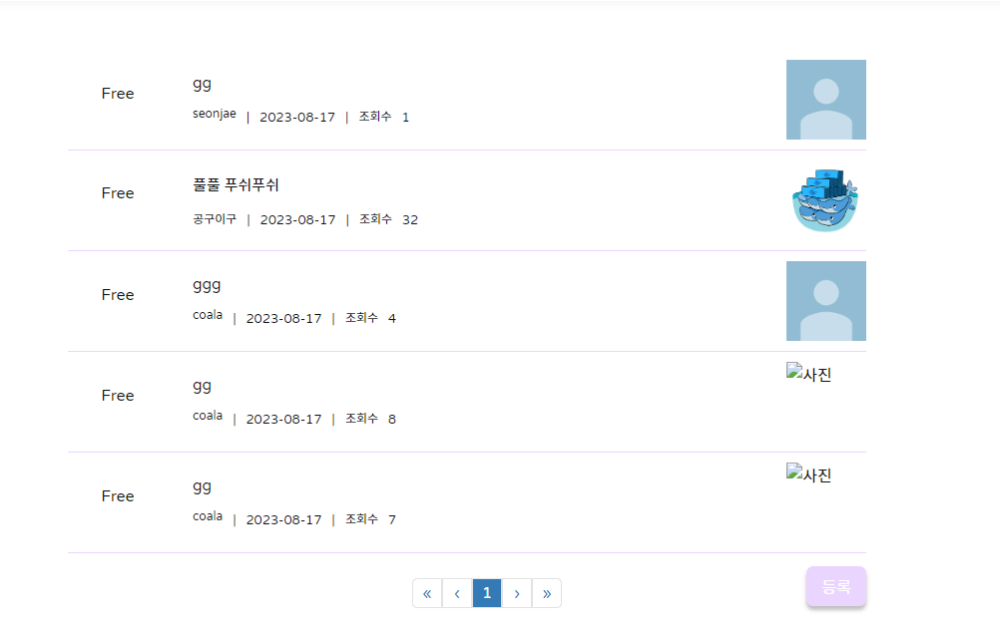

<br>

### **자유게시판 **
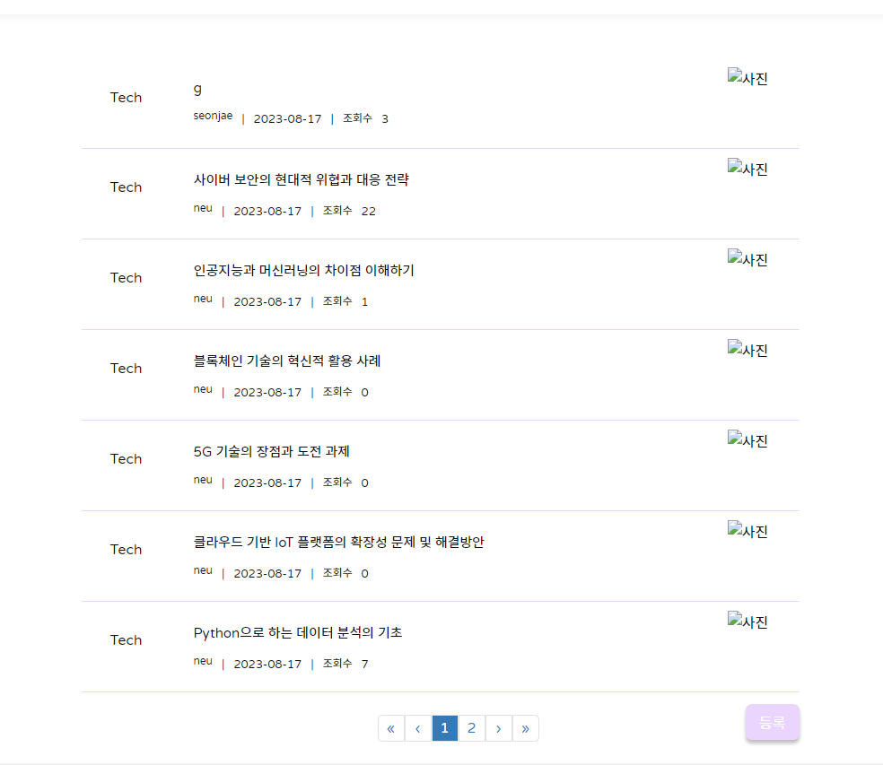


<br>

### **제공자 게시판**
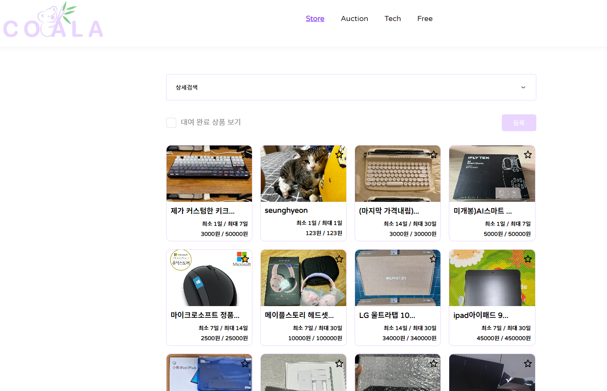
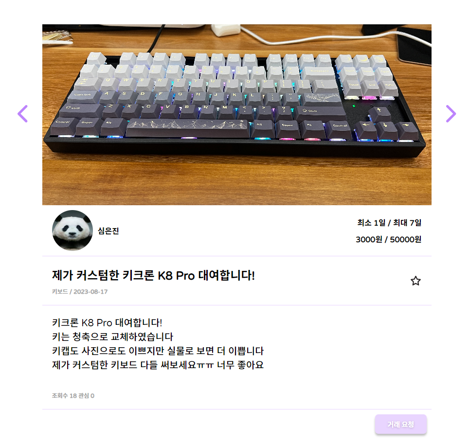


<br>

### **이용자 게시판**
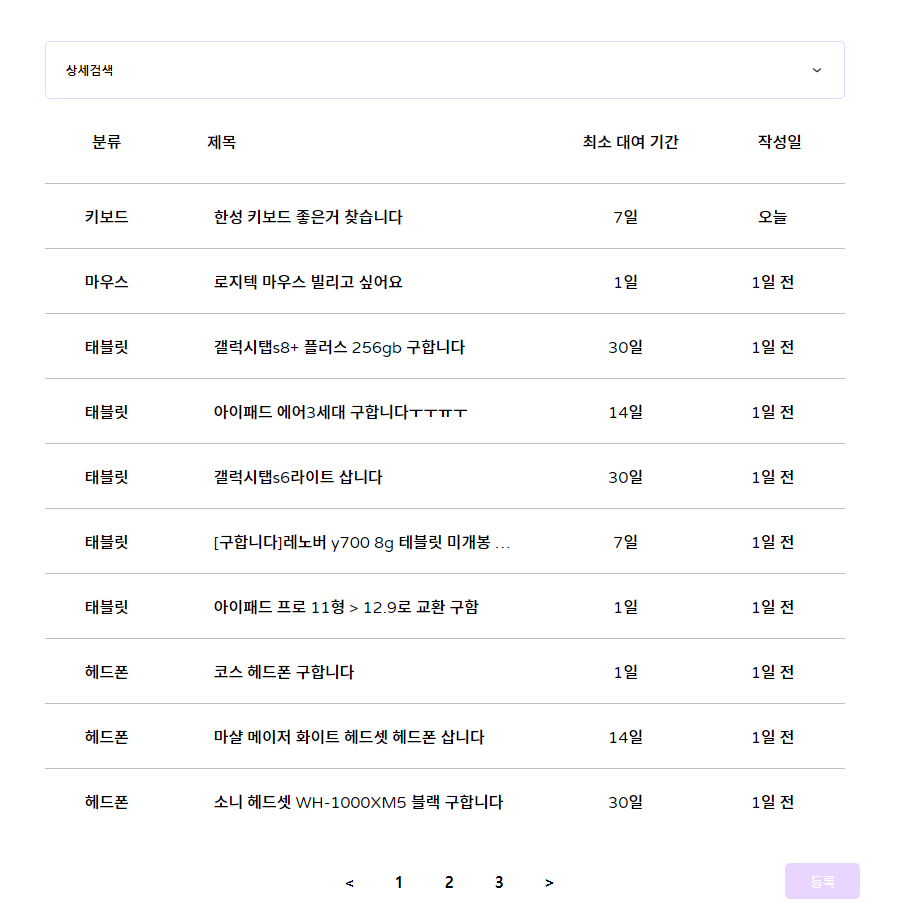
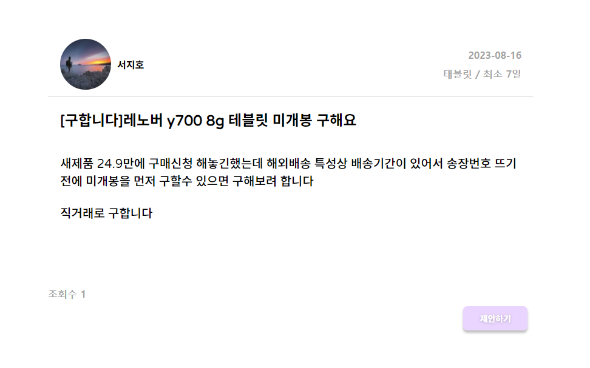


<br>

### **채팅**
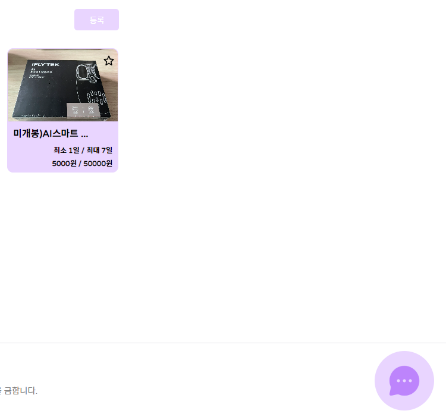
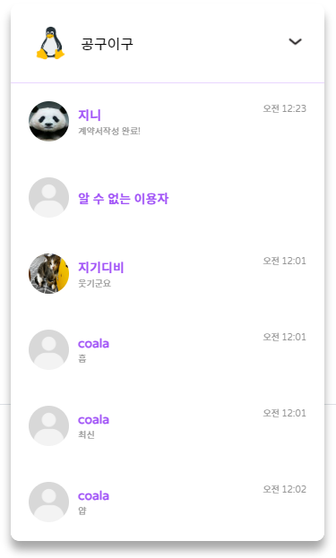


<br>

### **계약서 작성**


<br>

